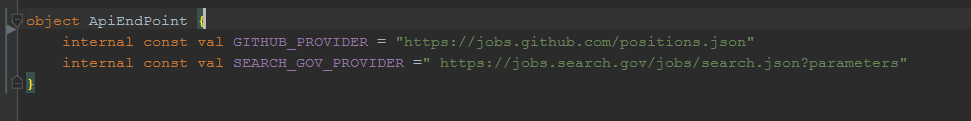
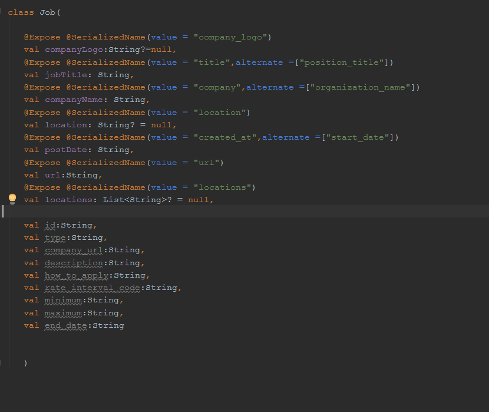
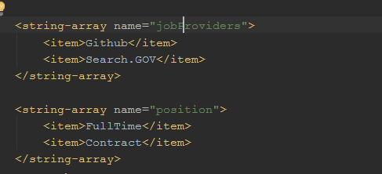
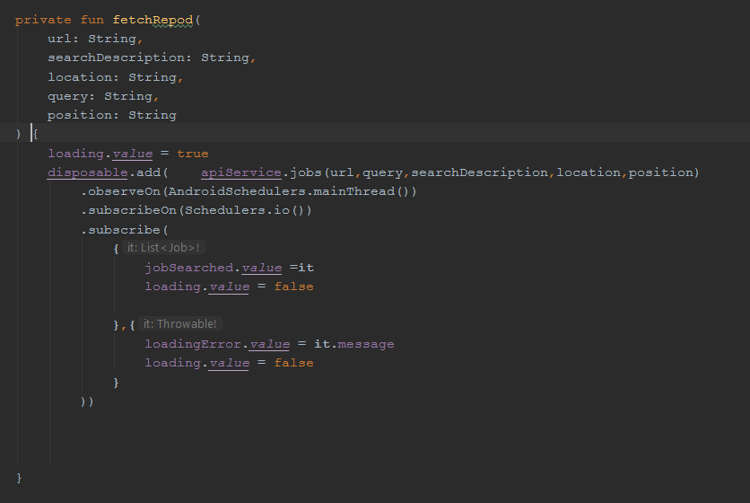
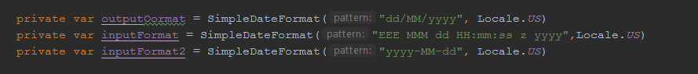
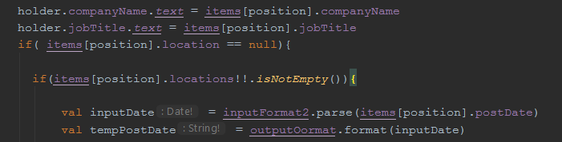

# JobFinder
This is an android app for finding a job and add a provider by changing some code.

<b>How To Add New Provider</b>
 
1st of all add base url in the ApiEndPoint.kt , as in the picture below

 Then in the Job.kt add the field name from JSON provided by the new provider. If there are field consisting company Logo, job title, 
 
 company name, job url, location or locations(list of location), postdate then add serializedName in alternate . And remaining field name,
 
 add as simple variables as shown in the figure. 
 
 
 
After updating  the data class Job.kt, add the providers name is “jobProviders” string array in string.xml. 

If there is need for update in Api service, then update it by following steps.

Add a annotation Query(“querytype”) demoQuery: String in the parameter.

 
 
Add a parameter in functions as needed.

If date is needed to formatted then there is need to update code in JobsAdapter.    

  
  
  
